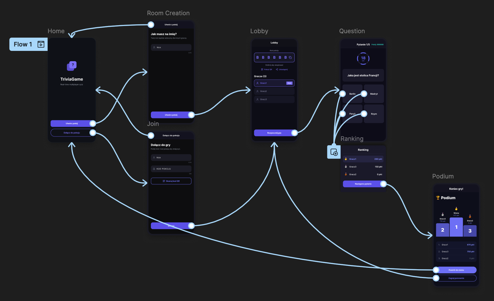
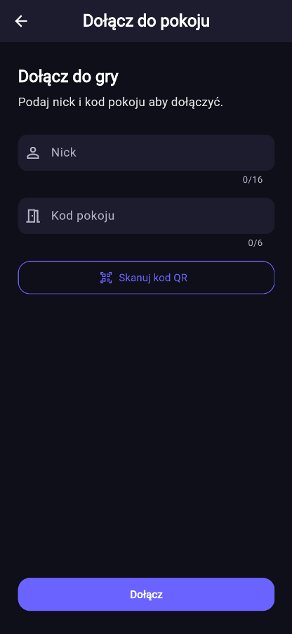
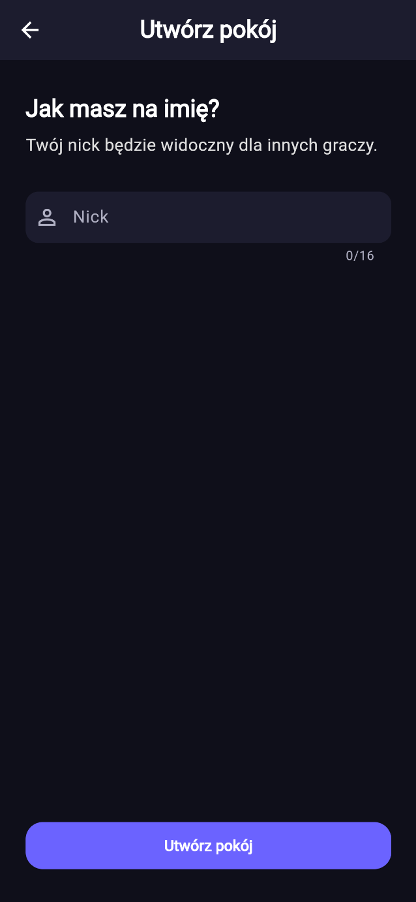
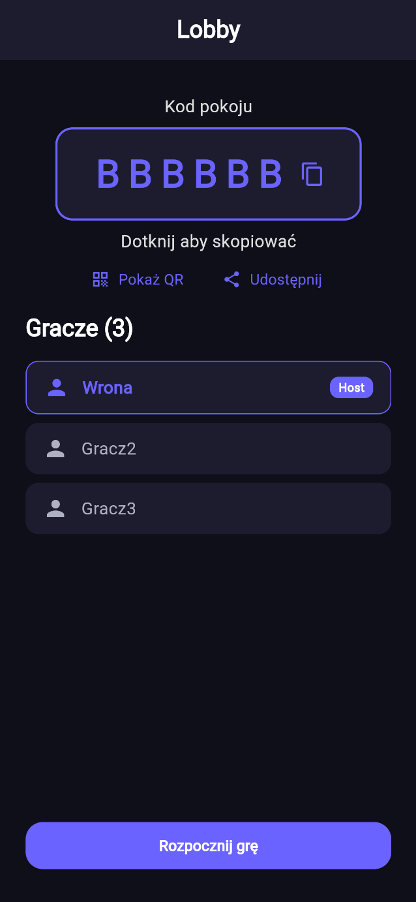
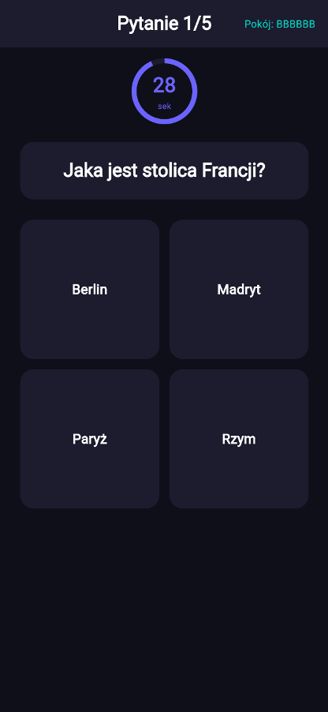
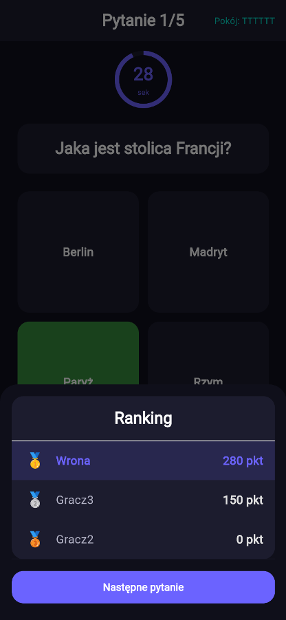
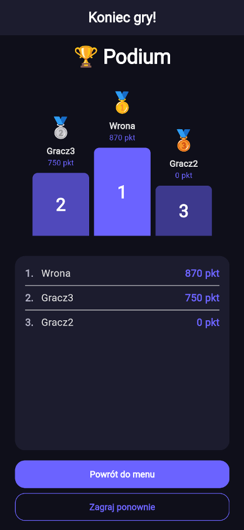
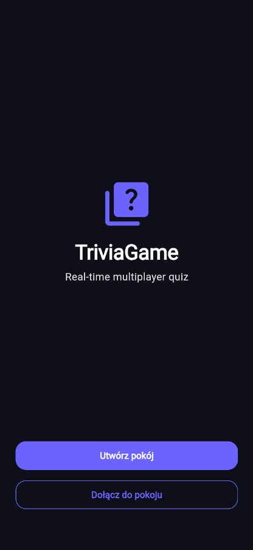

# Trivia Game Leader

## Krótki opis:
Quiz multiplayer na żywo – twórz pokoje i rywalizuj ze znajomymi.

## Testy wewnętrzne (Google Play)
[Dołącz do testów na Androida](https://play.google.com/apps/internaltest/4701590140570213987)

## Pełny opis aplikacji
Rywalizuj ze znajomymi w quizach multiplayer w czasie rzeczywistym. Twórz własne pokoje, dołączaj za pomocą kodu lub QR i sprawdzaj swoją wiedzę w dynamicznych rozgrywkach online.
Aplikacja pozwala szybko rozpocząć quiz i grać razem z innymi uczestnikami na żywo. Host może tworzyć pokoje, wybierać kategorie oraz zarządzać przebiegiem gry, a gracze odpowiadają na pytania i zdobywają punkty za poprawność oraz szybkość odpowiedzi.

**Słowa kluczowe:** quiz, quiz multiplayer, quiz online, trivia, kahoot, gra quizowa, pytania i odpowiedzi, multiplayer, quiz na żywo, ranking, gra wiedzy, quiz ze znajomymi, live quiz, quiz room, trivia game, quiz polski, szybki quiz, gry imprezowe, edukacja, rywalizacja online

## Minimum Viable Product (MVP)
### Zarządzanie pokojami i tożsamością:
- Tworzenie pokoju przeze mnie (jako hosta) i generowanie unikalnego kodu dołączenia.
- Dołączanie do pokoju za pomocą wpisanego kodu przez graczy.
- Wybór unikalnego pseudonimu (2–16 znaków) przed wejściem, co pozwala identyfikować graczy w rankingu.

### Lobby i synchronizacja:
- Wyświetlanie listy graczy w lobby, która aktualizuje się na bieżąco przez WebSocket.
- Powiadomienia w czasie rzeczywistym (np. start gry, nowe pytania) bez konieczności odświeżania strony po stronie klienta.

### Przebieg gry:
- Wybór gotowej kategorii pytań przed startem rozgrywki.
- Rozpoczęcie gry z poziomu hosta, po którym blokowane jest dołączanie nowych osób do pokoju.
- Wyświetlanie tego samego pytania, 4 możliwych odpowiedzi i timera na ekranach wszystkich graczy jednocześnie.

### Mechanika odpowiedzi i punktacja:
- Możliwość wysłania tylko jednej, ostatecznej odpowiedzi do serwera.
- System punktacji premiujący poprawność oraz czas reakcji (szybsza odpowiedź = więcej punktów).

### Ranking i zakończenie:
- Automatyczne przechodzenie systemu do kolejnego pytania.
- Generowanie przejściowego rankingu z topką graczy po każdym pytaniu.
- Zakończenie quizu z ostatecznym podsumowaniem, wyświetlające miejsca 1–3.

## User Stories
1. **Dołączenie do pokoju**
Jako gracz chcę dołączyć do pokoju za pomocą kodu, aby uczestniczyć w quizie.
- użytkownik może wpisać kod pokoju
- system sprawdza czy pokój istnieje
- po poprawnym kodzie użytkownik trafia do lobby
- w przypadku błędnego kodu wyświetla się komunikat

2. **Tworzenie pokoju**
Jako host chcę utworzyć pokój, aby rozpocząć quiz.
- host może kliknąć „stwórz pokój”
- generowany jest unikalny kod
- pokój trafia do listy aktywnych
- host trafia do lobby jako administrator

3. **Wyświetlanie listy graczy w lobby**
Jako gracz chcę widzieć innych uczestników, aby wiedzieć kto bierze udział.
- lista aktualizuje się w czasie rzeczywistym (WebSocket)
- nowy gracz pojawia się automatycznie
- opuszczenie pokoju usuwa gracza z listy

4. **Rozpoczęcie gry**
Jako host chcę rozpocząć quiz, aby gracze mogli zacząć odpowiadać.
- tylko host może rozpocząć grę
- po kliknięciu wszyscy gracze przechodzą do pytania
- blokowane jest dołączanie nowych graczy

5. **Wyświetlanie pytania**
Jako gracz chcę widzieć pytanie, aby móc na nie odpowiedzieć.
- pytanie wyświetla się wszystkim jednocześnie
- widoczne są możliwe odpowiedzi
- widoczny jest timer

6. **Odpowiadanie na pytanie**
Jako gracz chcę wybrać odpowiedź, aby zdobyć punkty.
- użytkownik może kliknąć tylko jedną odpowiedź
- odpowiedź jest wysyłana do serwera
- po wyborze nie można zmienić odpowiedzi

7. **System punktacji**
Jako gracz chcę zdobywać punkty, aby rywalizować z innymi.
- poprawna odpowiedź daje punkty w zależności od poziomu trudności (łatwe: 100, średnie: 200, trudne: 300)
- błędna odpowiedź lub brak odpowiedzi = 0 punktów

8. **Ranking po pytaniu**
Jako gracz chcę widzieć ranking, aby znać swoją pozycję.
- ranking wyświetla top graczy
- aktualizuje się po każdym pytaniu
- pokazuje aktualne punkty

9. **Przechodzenie do kolejnego pytania**
Jako system chcę automatycznie przejść do kolejnego pytania, aby utrzymać tempo gry.
- po czasie lub odpowiedziach wszystkich graczy następuje przejście
- wszyscy gracze widzą nowe pytanie jednocześnie

10. **Zakończenie quizu**
Jako gracz chcę zobaczyć wyniki końcowe, aby wiedzieć kto wygrał.
- wyświetlany jest ranking końcowy
- pokazane są miejsca 1–3
- gra nie pozwala już odpowiadać

11. **Opuszczenie pokoju**
Jako gracz chcę opuścić pokój, aby zakończyć udział.
- użytkownik może kliknąć „wyjdź”
- zostaje usunięty z listy graczy
- inni widzą aktualizację

12. **Obsługa rozłączenia**
Jako gracz chcę wrócić do gry po utracie połączenia.
- system próbuje automatycznego reconnectu na poziomie WebSocket
- w przypadku zerwania połączenia aplikacja ponawia próbę połączenia z Hubem

13. **Wybór kategorii przed grą**
Jako host chcę wybrać kategorię, aby użyć jej w pokoju.
- host widzi listę kategorii
- może wybrać jedną przed startem
- wybrana kategoria jest używana w grze

14. **Powiadomienia w czasie rzeczywistym**
Jako gracz chcę dostawać powiadomienia o zmianach, aby być na bieżąco.
- powiadomienia działają przez WebSocket
- gracz widzi start gry, nowe pytania, ranking
- brak potrzeby odświeżania strony

15. **Cykliczne powiadomienia przypominające (Powiadomienia lokalne)**
Jako gracz chcę otrzymywać codzienne przypomnienia o stałej porze, aby systematycznie uczestniczyć w rozgrywkach trivia ze znajomymi.
- system weryfikuje status uprawnień do wyświetlania powiadomień lokalnych na systemach Android oraz iOS
- w przypadku braku wymaganych uprawnień aplikacja inicjuje systemowy monit o ich przyznanie
- po uzyskaniu autoryzacji system rejestruje cykliczne powiadomienie lokalne, zaplanowane na godzinę 18:00 czasu lokalnego
- powiadomienie wyświetla się ze zdefiniowanym nagłówkiem oraz treścią zachęcającą do gry
- interakcja z powiadomieniem (kliknięcie) powoduje uruchomienie aplikacji i przejście do ekranu głównego

## Funkcje Dodatkowe (Rozwój)
- **Szybkie udostępnianie (Kamera/QR):** Wykorzystanie sprzętowej warstwy smartfona do błyskawicznego skanowania kodu QR pokoju, omijające ręczne wpisywanie PIN-u.
- **Kreator własnych quizów:** Moduł REST API pozwalający hostowi na tworzenie własnych zestawów pytań z precyzyjnym określaniem poprawnych odpowiedzi. W MVP wystarczy mi bazowanie na wbudowanych kategoriach.
- **Autoryzacja i historia:** Ekran dla zalogowanych graczy pozwalający przeglądać historię swoich gier oraz szczegółowe wyniki per pytanie.
- **Zaawansowane zarządzanie pokojem (Moderacja):**
  - Wyrzucanie niechcianych graczy z lobby i bezpośrednie odcinanie ich od połączenia WebSocket.
  - Ustawianie sztywnego limitu maksymalnej liczby graczy w danym pokoju.
- **Zarządzanie połączeniem (Edge Cases):** Automatyczny reconnect, który w tle synchronizuje stan gry w przypadku nagłej utraty połączenia przez gracza
- **Warstwa audio-wizualna:** Działające po stronie klienta (niezależnie od WebSocket) animacje i dźwięki poprawnej/błędnej odpowiedzi oraz tykający pod koniec czasu timer

## Dlaczego aplikacja wymaga smartfona?
- **Wykorzystanie warstwy sprzętowej (Kamera do kodów QR):** Aplikacja oferuje funkcję szybkiego dołączania do pokoju oraz łatwego udostępniania go innym użytkownikom za pomocą skanowania kodu QR. Wymaga to urządzenia z wbudowanym aparatem, który użytkownik ma zawsze pod ręką, smartfon jest do tego naturalnym i najszybszym narzędziem.
- **Charakter „gry imprezowej” i mobilność graczy:** Projekt jest klasyfikowany m.in. w kategorii "gry imprezowe". Tego typu rozgrywka najczęściej odbywa się w jednym pomieszczeniu (np. na domówce, w klasie), gdzie host zarządza grą, a uczestnicy potrzebują osobistego, przenośnego "pilota" do głosowania. Smartfon pełni rolę prywatnego kontrolera, pozwalając na ukrycie swojego wyboru przed innymi graczami.
- **Kluczowa rola czasu reakcji i interfejsu dotykowego:** System punktacji zakłada, że "szybsza odpowiedź = więcej punktów". Ekran dotykowy smartfona pozwala na błyskawiczne podjęcie decyzji i fizyczne kliknięcie jednej z 4 możliwych odpowiedzi.

## Prototyp

- **Prototyp (Figma):** [Link do prototypu](https://www.figma.com/design/20NYZ1J9lPz46MyjMS3cbl/Trivia-Game?node-id=0-1&t=MVY1vBF5oASgMm0E-1)
- **Hasło do prototypu:** `scarf-canvas-slot-decaf`

## Materiały promocyjne

- [Materiały promocyjne (Figma)](https://www.figma.com/design/DbVxPsSPr8qjyi6hn0RqYq/Materialy-promoc?node-id=1-36&t=VasNDqX2ybVRi2ZC-1)

## Screeny aplikacji

  
  
  
  
  
  
  

## Persony użytkowników

### Persona 1 — Organizator rozgrywki towarzyskiej

**Michał Kowalski, 23 lata — student informatyki, Kraków**

#### Charakterystyka

Michał regularnie organizuje spotkania towarzyskie w gronie znajomych ze studiów. Szuka form aktywności, które angażują całą grupę bez konieczności tworzenia kont przez uczestników. Zna aplikacje typu Kahoot i szuka podobnych narzędzi działających na smartfonach. Pełni w aplikacji rolę hosta — tworzy pokój, wybiera kategorię i zarządza przebiegiem gry.

#### Cele

- Szybkie uruchomienie quizu dla grupy 4–10 osób bez rejestracji uczestników.
- Dobór kategorii pytań odpowiedniej dla grupy (np. Sport, Film, Nauka).
- Kontrola nad startem gry i możliwość jej restartu bez tworzenia nowego pokoju.
- Udostępnienie kodu dołączenia innym graczom możliwie najszybciej (QR lub kod słowny).

#### Frustracje

- Aplikacje wymagające zakładania kont przez każdego uczestnika.
- Desynchronizacja pytań między urządzeniami graczy.
- Brak funkcji restartu — konieczność tworzenia nowego pokoju po każdej rundzie.
- Skomplikowany interfejs wymagający tłumaczenia kolejnych kroków innym uczestnikom.

---

### Persona 2 — Gracz nastawiony na rywalizację

**Zofia Nowak, 19 lat — studentka I roku, Wrocław**

#### Charakterystyka

Zofię motywuje rywalizacja i widoczność wyników. Stara się odpowiadać poprawnie na pytania z wyższych poziomów trudności, ponieważ rozumie, że przekładają się na więcej punktów. Regularnie sprawdza ranking po każdym pytaniu. Ekran podium traktuje jako wynik, którym warto się podzielić.

#### Cele

- Dołączenie do pokoju w kilka sekund, bez konieczności tworzenia konta.
- Uzyskanie natychmiastowego feedbacku po wyborze odpowiedzi (poprawna/błędna).
- Śledzenie aktualnej pozycji w rankingu na bieżąco.
- Znalezienie się w top 3 i zobaczenie podium na ekranie końcowym.

#### Frustracje

- Brak potwierdzenia poprawności odpowiedzi bezpośrednio po jej wyborze.
- Nieaktualne dane w rankingu — opóźnienie w odświeżaniu wyników.
- Konieczność czekania na gracza, który nie kliknął „Gotowy" po pytaniu.

---

## Dokumentacja

- Backend: [arekminajj/trivia-game-backend](https://github.com/arekminajj/trivia-game-backend)
- Base URL: `http://trivia.arkadiuszcios.online`
- Specyfikacja OpenAPI: [docs/openapi.yaml](docs/openapi.yaml)

Pełna dokumentacja endpointów REST oraz SignalR Hub: [docs/api_documentation.md](docs/api_documentation.md)

Instrukcja użytkownika: [docs/user_guide.md](docs/user_guide.md)

# Changelog — Trivia Game

- **Frontend** — [WCiovh/triviagame_flutter](https://github.com/WCiovh/triviagame_flutter) *(Flutter)*
- **Backend** — [arekminajj/trivia-game-backend](https://github.com/arekminajj/trivia-game-backend) *(ASP.NET Core + SignalR)*

## [Sprint 3 — Finalizacja i polishing] — 2026-05-19

### Frontend *(Wiktor Cioch)*

- **feat: „Play Again"** — host może zrestartować pokój przez SignalR; wszyscy gracze wracają do lobby
  - Naprawiono race condition przy restarcie
  - Nick hosta zachowywany po ponownym stworzeniu pokoju
  - Podświetlanie tekstu w polu input
  - Naprawiono nawigację wstecz i dialog wyjścia
- **feat: fix keyboard layout, back navigation, camera permission, room closed by host** — poprawki UX (układ klawiatury, nawigacja, uprawnienia do kamery, zamykanie pokoju przez hosta)
- **fix: html decode, timer, back button, kategorie, kolory odpowiedzi, auto-advance, orientacja pionowa** — zbiorcze poprawki UI/UX (dekodowanie HTML w pytaniach, timer, kategorie, kolory odpowiedzi, automatyczne przejście, blokada pozioma)
- **feat(integration): auth integration and bugfixes** — integracja autoryzacji z backendem + poprawki (Arkadiusz Cios)
- **feat(integration): initial backend service integration** — pierwsze połączenie warstwy Flutter z API backendu (Arkadiusz Cios)
- **docs: update README** — aktualizacja README, usunięcie pustych folderów placeholder
- **chore: remove unused import** — usunięcie nieużywanego importu `material.dart` z `app_router`

### Backend *(Wiktor Cioch)*

- **feat: RestartGame hub method** — metoda SignalR resetuje stan pokoju i powiadamia wszystkich graczy
- **feat: close room for all players when host disconnects from lobby** — zamknięcie pokoju dla wszystkich przy rozłączeniu hosta
- **feat: add CategoryName to Room and RoomResponse** — gracz dołączający widzi kategorię w lobby

---

## [Sprint 3 — Stabilność i error handling] — 2026-05-19

### Backend *(Arkadiusz Cios)*

- **feat: #5 add network error handling with Polly retry and exception middleware** — obsługa błędów sieciowych: mechanizm retry z biblioteką Polly + middleware do obsługi wyjątków
- **fix: #3 validate submitted answers against shuffled answer list** — naprawiono walidację odpowiedzi: sprawdzanie względem potasowanej listy zamiast oryginalnej kolejności
- **feat: SignalR disconnection handling** — obsługa rozłączeń klientów SignalR

---

## [Sprint 2 — Gameplay i lobby] — 2026-05-15

### Frontend *(Wiktor Cioch)*

- **Merge PR #43 -> develop** — wdrożenie zestawu funkcjonalności rozgrywki do głównej gałęzi develop
- **docs: aktualizacja README** — zaktualizowana dokumentacja projektu (Merge PR #44)

## [Sprint 3 — Finalizacja i polishing] — 2026-05-19

### Frontend *(Wiktor Cioch)*

- **feat: „Play Again"** — host może zrestartować pokój przez SignalR; wszyscy gracze wracają do lobby
  - Naprawiono race condition przy restarcie
  - Nick hosta zachowywany po ponownym stworzeniu pokoju
  - Podświetlanie tekstu w polu input
  - Naprawiono nawigację wstecz i dialog wyjścia
- **feat: fix keyboard layout, back navigation, camera permission, room closed by host** — poprawki UX (układ klawiatury, nawigacja, uprawnienia do kamery, zamykanie pokoju przez hosta)
- **fix: html decode, timer, back button, kategorie, kolory odpowiedzi, auto-advance, orientacja pionowa** — zbiorcze poprawki UI/UX (dekodowanie HTML w pytaniach, timer, kategorie, kolory odpowiedzi, automatyczne przejście, blokada pozioma)
- **feat(integration): auth integration and bugfixes** — integracja autoryzacji z backendem + poprawki (Arkadiusz Cios)
- **feat(integration): initial backend service integration** — pierwsze połączenie warstwy Flutter z API backendu (Arkadiusz Cios)
- **docs: update README** — aktualizacja README, usunięcie pustych folderów placeholder
- **chore: remove unused import** — usunięcie nieużywanego importu `material.dart` z `app_router`

### Backend *(Wiktor Cioch)*

- **feat: RestartGame hub method** — metoda SignalR resetuje stan pokoju i powiadamia wszystkich graczy
- **feat: close room for all players when host disconnects from lobby** — zamknięcie pokoju dla wszystkich przy rozłączeniu hosta
- **feat: add CategoryName to Room and RoomResponse** — gracz dołączający widzi kategorię w lobby

---

## [Sprint 3 — Stabilność i error handling] — 2026-05-19

### Backend *(Arkadiusz Cios)*

- **feat: #5 add network error handling with Polly retry and exception middleware** — obsługa błędów sieciowych: mechanizm retry z biblioteką Polly + middleware do obsługi wyjątków
- **fix: #3 validate submitted answers against shuffled answer list** — naprawiono walidację odpowiedzi: sprawdzanie względem potasowanej listy zamiast oryginalnej kolejności
- **feat: SignalR disconnection handling** — obsługa rozłączeń klientów SignalR

---

## [Sprint 2 — Testy i CI/CD] — 2026-05-14

### Backend *(Arkadiusz Cios)*

- **test: add xUnit unit tests for Room, GameService, and RoomService** — testy jednostkowe xUnit pokrywające modele `Room`, serwis gry (`GameService`) i serwis pokoju (`RoomService`)
- **ci: add GitHub Actions CI — build & test** — pipeline CI/CD: automatyczny build i uruchamianie testów przy każdym pushu

---

## [Sprint 1 — Fundament backendu] — 2026-05-14

### Backend *(Arkadiusz Cios)*

- **Inicjalna wersja backendu** — projekt ASP.NET Core z SignalR Hub do zarządzania pokojami i grą
  - Model `Room` z zarządzaniem graczami i stanem gry
  - `GameService` — logika pobierania pytań z Open Trivia DB, obsługa tury, zliczanie punktów
  - `RoomService` — tworzenie/dołączanie do pokoi, generowanie kodów
  - Endpointy REST + SignalR Hub (`GameHub`)
  - Konfiguracja CORS i Swagger

## Autorzy

| Autor | GitHub | Rola |
|---|---|---|
| Kacper Wrona | [@Wronk4](https://github.com/Wronk4) | Lider Projektu |
| Wiktor Cioch | [@WCiovh](https://github.com/WCiovh) | Frontend (Flutter) |
| Arkadiusz Cios | [@arekminajj](https://github.com/arekminajj) | Backend (ASP.NET Core) |

---
*Projekt tworzony w ramach przedmiotu Programowanie aplikacji mobilnych.*
